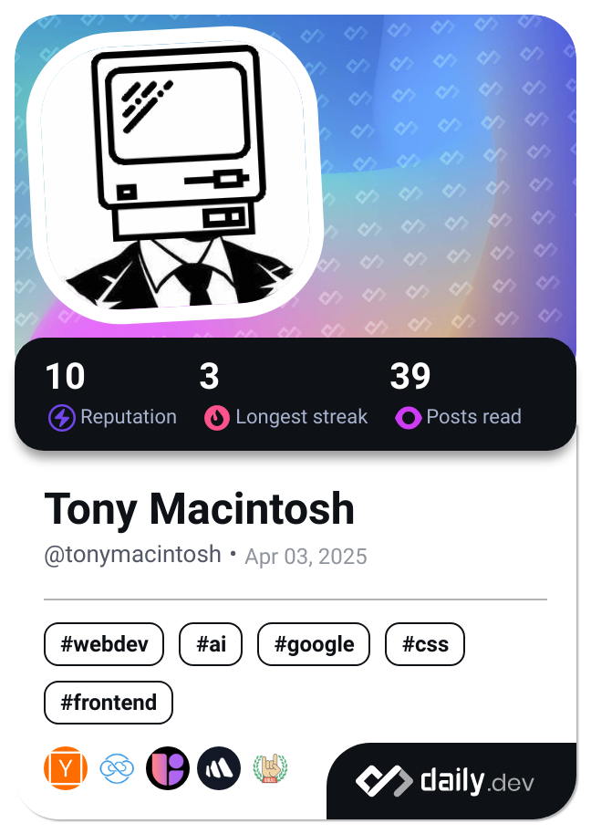

<h1 align="center">Hi 👋, I'm Tony Macintosh</h1>
<h3 align="center">A passionate full stack developer from the USA</h3>

- 🔭 I’m currently working on **Crypted**

- 🌱 I’m currently learning **Objective C++**

- 👯 I’m looking to collaborate on **many projects!**

- 🤝 I’m looking for help with **Crypted**

- 👨‍💻 All of my projects are available in [the repositories tab](the repositories tab)

- 💬 Ask me about **C++**

- 📫 How to reach me **tonymacintosh on Discord**

- ⚡ Fun fact **I've been developing since I was 8**

<h3 align="left">Connect with me:</h3>

<h3 align="left">Languages and Tools:</h3>

                               

